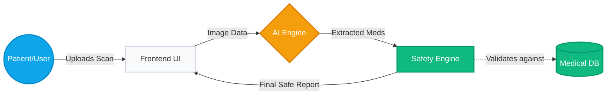
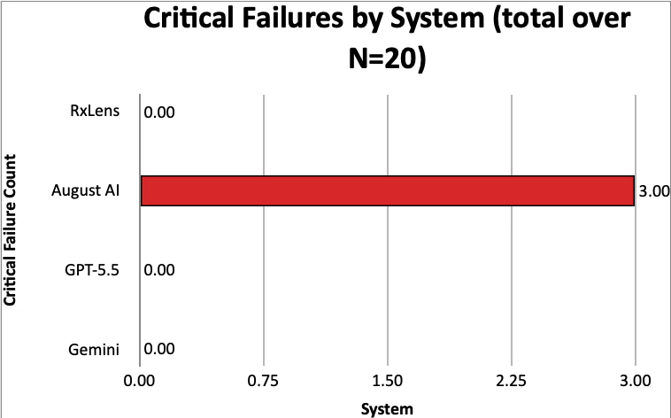
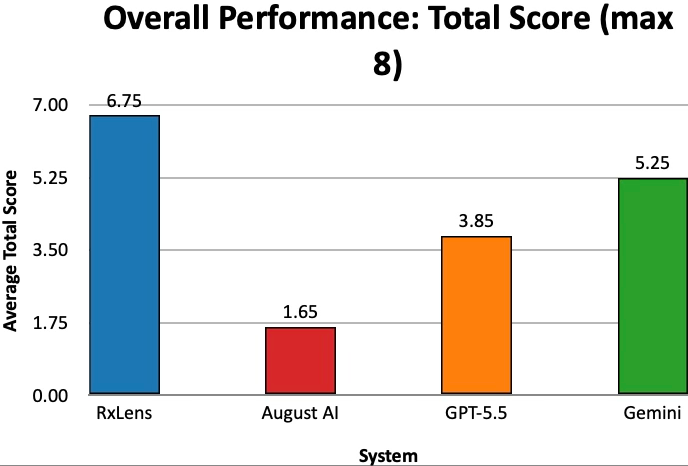

<div align="center">
  <h1>🩺 RxLens</h1>
  <p><b>AI-powered clinical decision-support and prescription intelligence platform using multimodal AI, deterministic safety systems, and multilingual healthcare accessibility tools.</b></p>

  [](https://rxlens-app.vercel.app)
  [](https://rxlens-app.vercel.app)
  [](https://rxlens-app.vercel.app)
  [](https://rxlens-app.vercel.app)
  
  <br />
  
  ### 🌐 [Live Demo → rxlens-app.vercel.app](https://rxlens-app.vercel.app)
  
  <br />
  <a href="https://drive.google.com/file/d/1WJ83sfL-2bHJNv6N9bmv9Z0eUpWknvhq/view?usp=sharing" target="_blank">View Demo Video</a>
</div>


 

<br />

<p align="center">
  
</p>

> [!WARNING]  
> **Disclaimer:** Educational healthcare AI prototype for research and demonstration purposes only. Not a substitute for licensed medical advice.

<br />

## 🌍 Why It Matters

Medication misinterpretation and poor adherence remain major contributors to preventable healthcare complications worldwide. RxLens was built to explore how multimodal AI can solve these global challenges—from elderly patients struggling with complex polypharmacy and cognitive overload, to non-native speakers unable to read local prescription instructions. By combining Vision-Language Models (VLMs) with deterministic clinical safety protocols, RxLens ensures that healthcare intelligence is both universally accessible and rigorously safe.

---

## 🌟 Key Features

| Feature | Description |
|---|---|
| 🔍 **Zero-Shot VLM Engine** | Replaces brittle OCR with Gemini 2.0 Flash to simultaneously transcribe and structure messy handwriting into strict JSON. |
| 🛡️ **Polypharmacy Assistant** | Flags medication-burden patterns for clinician review — duplicate therapies, high anticholinergic/sedative load in elderly patients — surfacing them as notes for a clinician to decide on, not automated deprescribing advice. |
| 🏥 **FHIR R4 Interoperability** | Converts extracted prescriptions into HL7 FHIR R4 Bundle format and pushes them to public HAPI FHIR test servers to demonstrate EHR integration standards. |
| 💰 **PMBJP Cost Savings** | Maps prescribed branded medications to PMBJP (Janaushadhi) generic alternatives, showing indicative cost savings and linking to nearby stores. |
| 💊 **Pill-Bottle Verification** | Lets patients photograph their dispensed pill bottle and cross-references it against the AI-extracted prescription to detect dispensing errors. |
| 🗓️ **Adherence Tracking** | Auto-generates a visual treatment timeline. Logs taken/missed doses locally to calculate an ongoing Adherence Score. |
| 🚨 **Hallucination Safeguards** | Explicitly warns users of AI involvement. Triggers "Pharmacist Consultation" alerts for any uncertain OCR extractions. |
| 🎙️ **Bilingual Accessibility** | Generates Text-to-Speech audio summaries in English and Hindi for low-literacy or low-vision patients. |
| ♿ **Elderly A+ Mode** | A UI toggle that increases typography size, enforces high-contrast borders, and simplifies the interface for low-vision and elderly users. |
| 🤖 **Clinical Chatbot** | "Ask RxLens" — a context-aware assistant scoped to the patient's extracted medications, with a visible "not medical advice, confirm with a pharmacist" guardrail. |
| 📊 **Insights Analytics** | Interactive Recharts dashboard visualizing drug-class frequency across the patient's history. |
| 📄 **PDF Export Engine** | Generates structured, clinic-ready tabular reports containing all extracted intelligence and safety alerts. |
| 👤 **Interactive Clinical Profile** | Lets patients define conditions, allergies, age, gender, and weight to check for cross-reactivity and tailor explanations. |
| 🛡️ **AI Safety Profile & Guard** | Combines a static, deterministic clinical interaction database (e.g., Aspirin + Warfarin) with patient-profile checking to reduce critical safety-hallucination risk. |
| ⚡ **Tailored Explanation Depths** | Custom explanation modes (Simple, Standard, Detailed) plus specialized healthcare-worker workflows. |
| 🤖 **VLM Model Cascading** | Backend model cascade (Gemini 2.5 Flash → 2.0 Flash → Flash Latest) to bypass rate limits and maximize uptime. |
| 💬 **Comprehension Verification** | Patient feedback loops ("Did you understand when to take this medicine?") to reinforce adherence. |

---

## 🏗️ System Architecture

*A simplified view of how data flows safely from the patient's camera through the AI and Safety validation layers.*



---

## 📸 Screenshots & Demo

<p align="center">
  <a href="https://drive.google.com/file/d/1WJ83sfL-2bHJNv6N9bmv9Z0eUpWknvhq/view?usp=sharing" target="_blank">
    
  </a>
</p>

<br />

<table align="center" style="border-collapse: collapse; border: none;">
  <tr>
    <td align="center" style="border: none;"><b>Extracted Medication Cards</b><br><br></td>
    <td align="center" style="border: none;"><b>Safety Alerts</b><br><br></td>
  </tr>
  <tr>
    <td align="center" style="border: none;"><b>Patient Adherence Dashboard</b><br><br></td>
    <td align="center" style="border: none;"><b>Generated PDF Report</b><br><br></td>
  </tr>
  <tr>
    <td align="center" style="border: none;"><b>Patient History (Dark Mode)</b><br><br></td>
    <td align="center" style="border: none;"><b>Audio Guide & Warnings</b><br><br></td>
  </tr>
</table>

---

## ⚖️ Ethical AI & Safety Constraints

Developing AI for healthcare requires immense responsibility. RxLens is designed with strict ethical boundaries:
- **No Direct Diagnoses:** RxLens never tells a patient to stop taking a medication. The Polypharmacy Assistant specifically outputs "Discussion Notes for Healthcare Providers."
- **Deterministic Safety:** The Drug Interaction engine is *not* AI-driven. It relies on a hardcoded clinical database to guarantee that critical alerts (like Aspirin + Warfarin) are never hallucinated.
- **Data Privacy:** All patient profiles and adherence logs are stored exclusively via local browser storage.

---

## 🚀 Deployment & Local Setup

### 1-Click Live Deployment

<p>
  <a href="https://vercel.com/new/clone?repository-url=https://github.com/sameekshajangra/RxLens/tree/main"></a>
</p>

- **Production:** A single Vercel monorepo deployment. 
- **Frontend:** React 18 built with Vite.
- **Backend:** FastAPI compiled into Vercel Serverless Functions via `vercel.json`.

---

### Local Setup
```bash
git clone https://github.com/your-username/RxLens.git
cd RxLens

# Local Development Setup
echo "GEMINI_API_KEY=your_key_here" > .env
pip install -r requirements.txt

# Terminal 1: Run Backend (FastAPI)
cd api && python -m uvicorn index:app --reload --port 8000

# Frontend Setup
cd ../frontend
npm install && npm run dev
```

---

## 🗺️ Future Roadmap

- **Larger Pharmacist-Validated Benchmark:** Expanding the current N=20 pilot evaluation into a comprehensive, multi-region journal study with fine-grained edit-distance metrics.
- **Persistent Encrypted Accounts:** Secure cloud synchronization for patient profiles, allowing historical tracking across multiple devices.
- **Multi-Language Support & ABDM Integration:** Adding support for more regional languages and integrating with India's Ayushman Bharat Digital Mission (ABDM) via ABHA ID.

