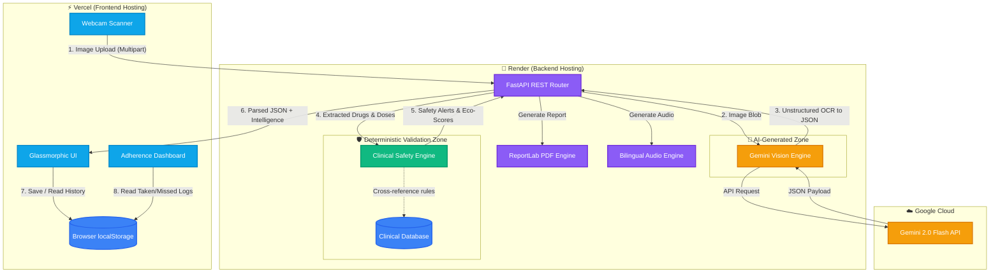

# RxLens 🩺 – Longitudinal Medication Intelligence Platform

[]()
[]()
[]()
[]()
[]()

RxLens is an AI-powered clinical decision-support and prescription intelligence platform that extends beyond traditional OCR pipelines. It digitizes handwritten and printed prescriptions, cross-references medications against a custom clinical database, and generates **proactive clinical intelligence** including treatment schedules, Polypharmacy De-prescribing notes, and Environmental Impact scores. 

Built for global healthcare accessibility, it provides **bilingual audio guidance** (English & Hindi) and features a dedicated **A+ Elderly Accessibility Mode**.

---

## 🌍 Real-World Relevance & Clinical Impact

Medication misinterpretation and poor adherence remain major contributors to preventable healthcare complications worldwide, particularly among elderly and multilingual populations. RxLens was designed to explore how multimodal AI systems can improve medication accessibility, safety, and patient understanding through responsible clinical intelligence tools.

- **Prescription Misinterpretation:** Unclear or complex drug regimens frequently lead to dangerous dosing errors at home.
- **Elderly Patient Adherence:** Aging populations often struggle with cognitive overload when managing multiple overlapping prescriptions.
- **Polypharmacy Risks:** Older adults taking multiple medications face significantly increased risks of adverse drug events (ADEs), duplicate therapies, and dangerous sedative loads.
- **Multilingual Accessibility Gaps:** Non-native speakers often cannot read the localized language on printed medication instructions, leading to non-compliance.

RxLens addresses these exact pain points through a synthesis of Vision-Language Models (VLMs) and deterministic, rule-based clinical safety protocols.

---

## 🏗️ System Architecture

RxLens utilizes a modern, decoupled client-server architecture. The Vision Language Model (VLM) handles unstructured optical extraction, while a deterministic, rule-based clinical engine handles all safety protocols to prevent AI hallucinations in medical data.



---

## 🌟 Core Clinical Features

| Feature | Description |
|---|---|
| 🔍 **Zero-Shot VLM Engine** | Replaces brittle OCR with Gemini 2.0 Flash to simultaneously transcribe and structure messy handwriting into strict JSON. |
| 🛡️ **Polypharmacy Assistant** | Generates clinician-facing "De-prescribing Notes", flagging excessive medication burdens, duplicate therapies, and dangerous sedative loads in elderly patients. |
| 🌍 **Green Pharmacy Score** | Calculates the environmental footprint of the prescription (e.g., flagging inhalers for greenhouse gases or endocrine disruptors) and provides eco-disposal instructions. |
| 🗓️ **Adherence Tracking** | Auto-generates a visual treatment timeline. Logs taken/missed doses locally to calculate an ongoing "Adherence Score." |
| 🚨 **Hallucination Safeguards** | Explicitly warns users of AI involvement. Triggers "Pharmacist Consultation" alerts for any uncertain OCR extractions. |
| 🎙️ **Bilingual Accessibility** | Generates professional Text-to-Speech audio summaries in English and Hindi for illiterate or visually impaired patients. |
| ♿ **Elderly A+ Mode** | A dedicated UI toggle that increases global typography size, enforces high-contrast borders, and simplifies the user interface for visually impaired users. |
| 🤖 **Clinical Chatbot** | "Ask RxLens" context-aware chatbot allows patients to ask follow-up questions about their specific medications. |
| 📊 **Insights Analytics** | Interactive Recharts dashboard visualizing the frequency of specific drug classes over the patient's history. |
| 📄 **PDF Export Engine** | Generates highly structured, clinic-ready tabular reports containing all AI intelligence and safety alerts. |

---

## 🚀 Live Deployment Guide

RxLens is configured for immediate cloud deployment.

### 1. Backend (Render)
The repository includes a `render.yaml` file for 1-click infrastructure deployment.
1. Connect this GitHub repo to your Render dashboard.
2. Render will automatically detect `render.yaml` and deploy the FastAPI server.
3. *Don't forget to add your `GEMINI_API_KEY` to the Render environment variables!*

### 2. Frontend (Vercel)
The repository includes a `vercel.json` file to handle React router configuration and proxy API requests.
1. Connect this repo to Vercel.
2. Set the Root Directory to `frontend`.
3. Vercel will automatically build and deploy the UI.

---

## 💻 Local Development Setup

### Prerequisites
- **Python 3.9+**
- **Node.js 18+** & **npm**
- **Google Gemini API Key** → [Get one free here](https://aistudio.google.com/)

### Step 1 — Backend Setup
```bash
git clone https://github.com/your-username/RxLens.git
cd RxLens

# Add your Gemini API Key
echo "GEMINI_API_KEY=your_key_here" > .env

# Install dependencies and run
pip install -r requirements.txt
cd backend
python -m uvicorn main:app --reload
```
*Backend runs on `http://localhost:8000`*

### Step 2 — Frontend Setup
Open a new terminal tab:
```bash
cd RxLens/frontend
npm install
npm run dev
```
*Frontend runs on `http://localhost:5173`*

---

## ⚖️ Ethical Considerations & Limitations

Developing AI for healthcare requires immense responsibility. RxLens is designed with the following ethical boundaries:
1. **No Direct Diagnoses:** RxLens never tells a patient to stop taking a medication. The Polypharmacy Assistant specifically outputs "Discussion Notes for Healthcare Providers."
2. **AI Hallucination Transparency:** A persistent UI and PDF banner warns users that the data is AI-generated and must be verified by a licensed pharmacist.
3. **Deterministic Safety:** The Drug-Drug Interaction engine (`src/safety_engine.py`) is *not* AI-driven. It relies on a hardcoded, deterministic database (`src/safety_db.py`) to guarantee that critical alerts (like Aspirin + Warfarin) are never missed due to LLM variance.
4. **Data Privacy:** In the current build, all patient profiles and adherence logs are stored exclusively via local browser storage (`localStorage`). No patient data is saved to the cloud.

---

## 🗺️ Future Roadmap

- **EHR Integration:** Implement FHIR (Fast Healthcare Interoperability Resources) standards to allow pushing generated reports directly to hospital Epic/Cerner systems.
- **Computer Vision Pill Identification:** Allow patients to scan the physical pill bottle to verify against counterfeit packaging or incorrect pharmacy dispensing.
- **Advanced Predictive ML:** Implement a small localized neural network to predict the statistical likelihood of a patient abandoning their treatment based on the drug's side-effect profile.

---

*Built for the future of global medical accessibility. Designed for demonstration.*
