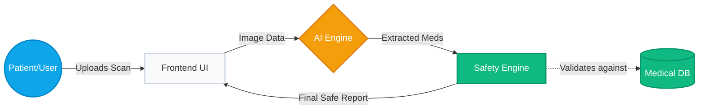

<div align="center">
  <h1>🩺 RxLens</h1>
  <p><b>AI-powered clinical decision-support and prescription intelligence platform using multimodal AI, deterministic safety systems, and multilingual healthcare accessibility tools.</b></p>

  [](https://rxlens-app.vercel.app)
  [](https://rxlens-app.vercel.app)
  [](https://rxlens-app.vercel.app)
  [](https://rxlens-app.vercel.app)
  
  <br />
  
  ### 🌐 [Live Demo → rxlens-app.vercel.app](https://rxlens-app.vercel.app)
  
  <br />
  <a href="https://drive.google.com/file/d/1WJ83sfL-2bHJNv6N9bmv9Z0eUpWknvhq/view?usp=sharing" target="_blank">View Demo Video</a>
</div>


 

<br />

<p align="center">
  
</p>

> [!WARNING]  
> **Disclaimer:** Educational healthcare AI prototype for research and demonstration purposes only. Not a substitute for licensed medical advice.

<br />

## 🌍 Why It Matters

Medication misinterpretation and poor adherence remain major contributors to preventable healthcare complications worldwide. RxLens was built to explore how multimodal AI can solve these global challenges—from elderly patients struggling with complex polypharmacy and cognitive overload, to non-native speakers unable to read local prescription instructions. By combining Vision-Language Models (VLMs) with deterministic clinical safety protocols, RxLens ensures that healthcare intelligence is both universally accessible and rigorously safe.

---

## 🌟 Key Features

| Feature | Description |
|---|---|
| 🔍 **Zero-Shot VLM Engine** | Replaces brittle OCR with Gemini 2.0 Flash to simultaneously transcribe and structure messy handwriting into strict JSON. |
| 🛡️ **Polypharmacy Assistant** | Generates clinician-facing "De-prescribing Notes", flagging excessive medication burdens, duplicate therapies, and dangerous sedative loads in elderly patients. |
| 🏥 **FHIR R4 Interoperability** | Converts extracted prescriptions into HL7 FHIR R4 Bundle format and pushes them to public HAPI FHIR test servers to demonstrate global EHR integration standards. |
| 💰 **PMBJP Cost Savings** | Maps prescribed branded medications to Pradhan Mantri Bhartiya Janaushadhi Pariyojana (PMBJP) generic alternatives, showing potential cost savings and linking to nearby stores. |
| 💊 **Pill-Bottle Verification** | Allows patients to photograph their dispensed physical pill bottle and cross-reference it against the AI-extracted prescription to detect critical dispensing errors. |
| 🗓️ **Adherence Tracking** | Auto-generates a visual treatment timeline. Logs taken/missed doses locally to calculate an ongoing "Adherence Score." |
| 🚨 **Hallucination Safeguards** | Explicitly warns users of AI involvement. Triggers "Pharmacist Consultation" alerts for any uncertain OCR extractions. |
| 🎙️ **Bilingual Accessibility** | Generates professional Text-to-Speech audio summaries in English and Hindi for illiterate or visually impaired patients. |
| ♿ **Elderly A+ Mode** | A dedicated UI toggle that increases global typography size, enforces high-contrast borders, and simplifies the user interface for visually impaired users. |
| 🤖 **Clinical Chatbot** | "Ask RxLens" context-aware chatbot allows patients to ask follow-up questions about their specific medications. |
| 📊 **Insights Analytics** | Interactive Recharts dashboard visualizing the frequency of specific drug classes over the patient's history. |
| 📄 **PDF Export Engine** | Generates highly structured, clinic-ready tabular reports containing all AI intelligence and safety alerts. |
| 👤 **Interactive Clinical Profile** | Allows patients to define conditions, allergies, age, gender, and weight to check for direct cross-reactivity and customize AI translation details. |
| 🛡️ **AI Safety Profile & Guard** | Combines a static, deterministic clinical interaction database (e.g., Aspirin + Warfarin) with patient profile checking to eliminate critical safety hallucination risks. |
| ⚡ **Tailored Explanation Depths** | Supports custom explanation modes (Simple, Standard, Detailed) for different patient reading comprehensions, as well as specialized Healthcare Worker workflows. |
| 🤖 **VLM Model Cascading** | Employs built-in backend model cascades (Gemini 2.5 Flash -> Gemini 2.0 Flash -> Gemini Flash Latest) to bypass rate limits and maximize uptime automatically. |
| 💬 **Comprehension Verification** | Prompts patient feedback loops ("Did you understand when to take this medicine?") to reinforce high-fidelity treatment adherence. |

---

## 🏗️ System Architecture

*A simplified view of how data flows safely from the patient's camera through the AI and Safety validation layers.*



---

## 📸 Screenshots & Demo

<p align="center">
  <a href="https://drive.google.com/file/d/1WJ83sfL-2bHJNv6N9bmv9Z0eUpWknvhq/view?usp=sharing" target="_blank">
    
  </a>
</p>

<br />

<table align="center" style="border-collapse: collapse; border: none;">
  <tr>
    <td align="center" style="border: none;"><b>Clinical Intelligence & Polypharmacy Review</b><br><br></td>
    <td align="center" style="border: none;"><b>Treatment Schedule & Clinical Summary</b><br><br></td>
  </tr>
  <tr>
    <td align="center" style="border: none;"><b>Patient Adherence Dashboard</b><br><br></td>
    <td align="center" style="border: none;"><b>Generated PDF Report</b><br><br></td>
  </tr>
  <tr>
    <td align="center" style="border: none;"><b>Patient History (Dark Mode)</b><br><br></td>
    <td align="center" style="border: none;"><b>Audio Guide & Warnings</b><br><br></td>
  </tr>
</table>

---

## ⚖️ Ethical AI & Safety Constraints

Developing AI for healthcare requires immense responsibility. RxLens is designed with strict ethical boundaries:
- **No Direct Diagnoses:** RxLens never tells a patient to stop taking a medication. The Polypharmacy Assistant specifically outputs "Discussion Notes for Healthcare Providers."
- **Deterministic Safety:** The Drug Interaction engine is *not* AI-driven. It relies on a hardcoded clinical database to guarantee that critical alerts (like Aspirin + Warfarin) are never hallucinated.
- **Data Privacy:** All patient profiles and adherence logs are stored exclusively via local browser storage.

---

## 🚀 Deployment & Local Setup

### 1-Click Live Deployment

<p>
  <a href="https://vercel.com/new/clone?repository-url=https://github.com/sameekshajangra/RxLens/tree/main/frontend"></a>
  &nbsp;&nbsp;
  <a href="https://render.com/deploy?repo=https://github.com/sameekshajangra/RxLens"></a>
</p>

- **Frontend (Primary):** Automatically deploy to Vercel via `vercel.json` routing (proxies `/api` to Render).
- **Frontend (Alternative):** Configured for Firebase Hosting via `firebase.json` (`npm run deploy`).
- **Backend:** Automatically deploy to Render via `render.yaml`.

---

### Local Setup
```bash
git clone https://github.com/your-username/RxLens.git
cd RxLens

# Backend Setup
echo "GEMINI_API_KEY=your_key_here" > .env
pip install -r requirements.txt
cd backend && python -m uvicorn main:app --reload

# Frontend Setup
cd ../frontend
npm install && npm run dev
```

---

## 🗺️ Future Roadmap

- **EHR Integration:** Implement FHIR (Fast Healthcare Interoperability Resources) standards to push reports directly to hospital systems.
- **Computer Vision Verification:** Allow patients to scan physical pill bottles to verify against counterfeit packaging.
- **Predictive ML:** Predict the statistical likelihood of treatment abandonment based on drug side-effect profiles.
