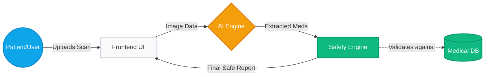
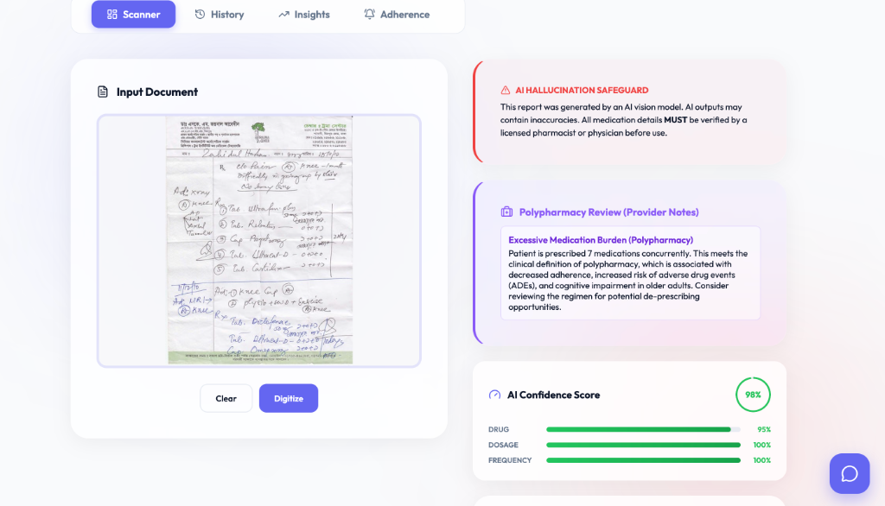
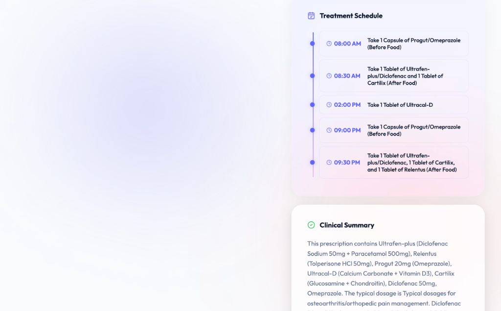
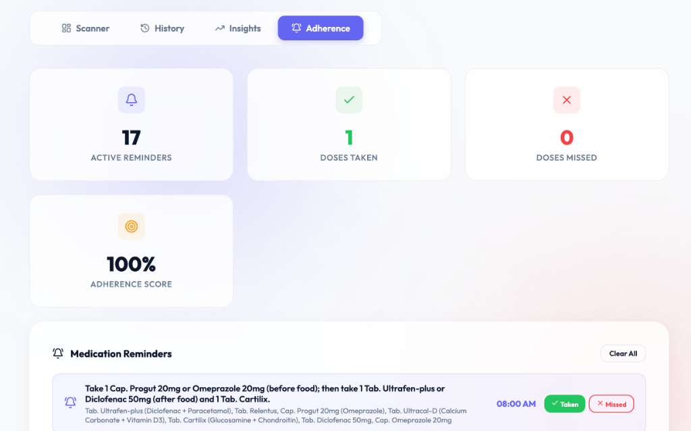
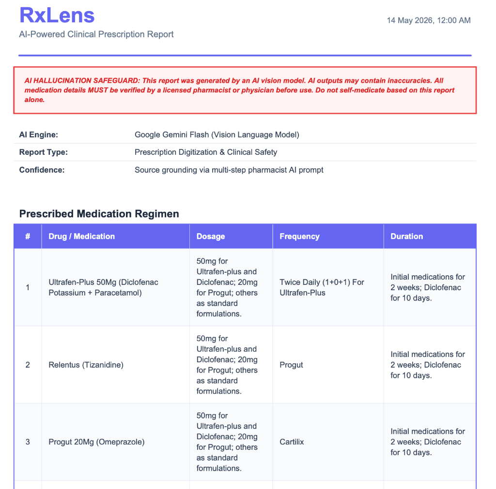
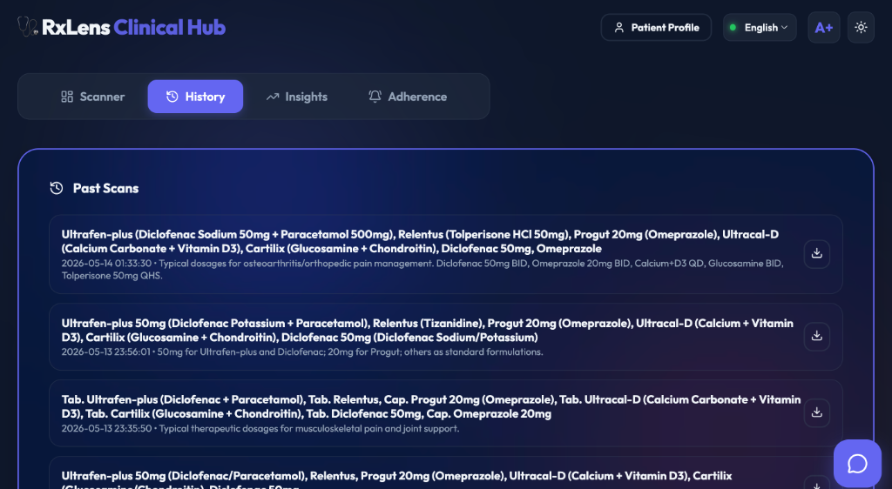
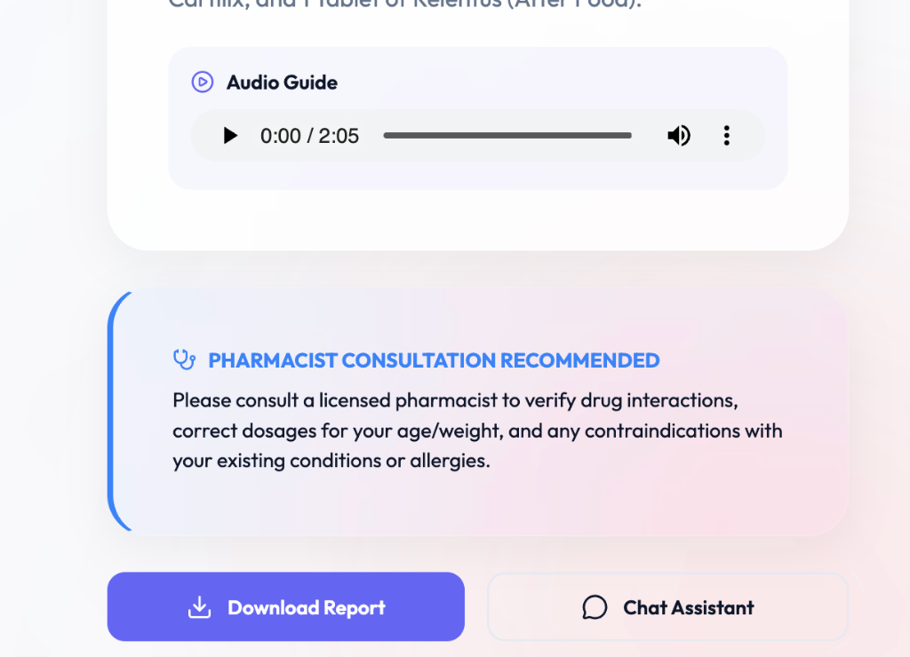

<div align="center">
  <h1>🩺 RxLens</h1>
  <p><b>AI-powered clinical decision-support and prescription intelligence platform using multimodal AI, deterministic safety systems, and multilingual healthcare accessibility tools.</b></p>

  []()
  []()
  []()
  []()
  
  <br />
  <a href="https://youtu.be/your_demo_video_link" target="_blank">View Demo Video</a> · 
  <a href="#live-deployment">Live App (Pending Deployment)</a>
</div>

<br />

## 🌍 Why It Matters

Medication misinterpretation and poor adherence remain major contributors to preventable healthcare complications worldwide. RxLens was built to explore how multimodal AI can solve these global challenges—from elderly patients struggling with complex polypharmacy and cognitive overload, to non-native speakers unable to read local prescription instructions. By synthesizing Vision-Language Models (VLMs) with strict, deterministic clinical safety protocols, RxLens ensures that healthcare intelligence is both universally accessible and rigorously safe.

---

## 🌟 Key Features

| Feature | Description |
|---|---|
| 🔍 **Zero-Shot VLM Engine** | Replaces brittle OCR with Gemini 2.0 Flash to simultaneously transcribe and structure messy handwriting into strict JSON. |
| 🛡️ **Polypharmacy Assistant** | Generates clinician-facing "De-prescribing Notes", flagging excessive medication burdens, duplicate therapies, and dangerous sedative loads in elderly patients. |
| 🌍 **Green Pharmacy Score** | Calculates the environmental footprint of the prescription (e.g., flagging inhalers for greenhouse gases or endocrine disruptors) and provides eco-disposal instructions. |
| 🗓️ **Adherence Tracking** | Auto-generates a visual treatment timeline. Logs taken/missed doses locally to calculate an ongoing "Adherence Score." |
| 🚨 **Hallucination Safeguards** | Explicitly warns users of AI involvement. Triggers "Pharmacist Consultation" alerts for any uncertain OCR extractions. |
| 🎙️ **Bilingual Accessibility** | Generates professional Text-to-Speech audio summaries in English and Hindi for illiterate or visually impaired patients. |
| ♿ **Elderly A+ Mode** | A dedicated UI toggle that increases global typography size, enforces high-contrast borders, and simplifies the user interface for visually impaired users. |
| 🤖 **Clinical Chatbot** | "Ask RxLens" context-aware chatbot allows patients to ask follow-up questions about their specific medications. |
| 📊 **Insights Analytics** | Interactive Recharts dashboard visualizing the frequency of specific drug classes over the patient's history. |
| 📄 **PDF Export Engine** | Generates highly structured, clinic-ready tabular reports containing all AI intelligence and safety alerts. |

---

## 🏗️ System Architecture

*A simplified view of how data flows safely from the patient's camera through the AI and Safety validation layers.*



---

## 📸 Screenshots & Demo

<table align="center" style="border-collapse: collapse; border: none;">
  <tr>
    <td align="center" style="border: none;"><b>Clinical Intelligence & Polypharmacy Review</b><br><br></td>
    <td align="center" style="border: none;"><b>Treatment Schedule & Clinical Summary</b><br><br></td>
  </tr>
  <tr>
    <td align="center" style="border: none;"><b>Patient Adherence Dashboard</b><br><br></td>
    <td align="center" style="border: none;"><b>Generated PDF Report</b><br><br></td>
  </tr>
  <tr>
    <td align="center" style="border: none;"><b>Patient History (Dark Mode)</b><br><br></td>
    <td align="center" style="border: none;"><b>Audio Guide & Warnings</b><br><br></td>
  </tr>
</table>

---

## ⚖️ Ethical AI & Safety Constraints

Developing AI for healthcare requires immense responsibility. RxLens is designed with strict ethical boundaries:
- **No Direct Diagnoses:** RxLens never tells a patient to stop taking a medication. The Polypharmacy Assistant specifically outputs "Discussion Notes for Healthcare Providers."
- **Deterministic Safety:** The Drug Interaction engine is *not* AI-driven. It relies on a hardcoded clinical database to guarantee that critical alerts (like Aspirin + Warfarin) are never hallucinated.
- **Data Privacy:** All patient profiles and adherence logs are stored exclusively via local browser storage.

---

## 🚀 Deployment & Local Setup

### Live Deployment
- **Frontend:** Deployed via Vercel (`vercel.json` included).
- **Backend:** Deployed via Render (`render.yaml` included).

### Local Setup
```bash
git clone https://github.com/your-username/RxLens.git
cd RxLens

# Backend Setup
echo "GEMINI_API_KEY=your_key_here" > .env
pip install -r requirements.txt
cd backend && python -m uvicorn main:app --reload

# Frontend Setup
cd ../frontend
npm install && npm run dev
```

---

## 🗺️ Future Roadmap

- **EHR Integration:** Implement FHIR (Fast Healthcare Interoperability Resources) standards to push reports directly to hospital systems.
- **Computer Vision Verification:** Allow patients to scan physical pill bottles to verify against counterfeit packaging.
- **Predictive ML:** Predict the statistical likelihood of treatment abandonment based on drug side-effect profiles.
